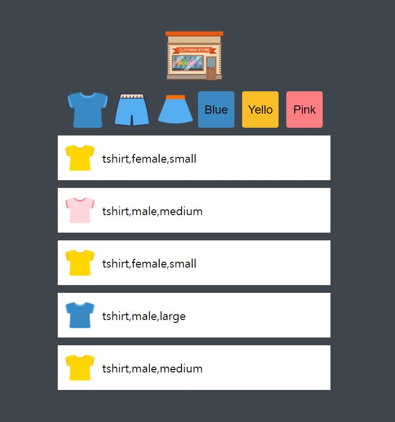

# shopping list

목록을 가져오고, 이를 상위 버튼들을 이용해서 filtering이 되도록 구현한 페이지 입니다.
**드림코딩** 강의를 통해 배웠습니다.

## 결과

[브라우저에서 보기!](https://jh8057.github.io/zzemal/projects/04.shopping/)

</img> 기본 페이지

</img></img>
filter 된 페이지

JSON으로 되어있는 Data에서 정보를 읽어서, list형태로 화면에 보여줍니다.  
상단의 버튼을 누르면 해당 관련 정보들만 filter가 되도록 구현하였습니다.
반응형으로 업데이트 했습니다.

# 새로 배운 내용

#### CSS

- 거의 모든 요소들을 :root안에 선언 해준 후, 그 값을 가져와서 사용했다.
- `overflow:scorll-y`를 하면 페이지 전체가 내려가지 않고, 해당 부분만 스크롤이 진행된다.

#### JS

- fetch API에서 url 뿐 아니라, 일반 경로를 적어도 적용된다.
- 아무것도 안쓰고 적으면 localhost에서 동작하는 것이다.
- innerHTML을 알게되었다.
- innerHTML은 HTML 요소들도 다룬다.
- sth.innerHTML = <태그>를 사용하면 이것이 그대로 HTML에서 작성한 것처럼 된다.
- 따라서, ``을 이용해서 string 형태로 반환해주면 변수를 사용하면서 html태그를 추가 해줄 수 있다.
- [innerText vs innerHTML](https://hianna.tistory.com/480)

#### 구조

- data는 따로 폴더를 만들어서 보관하는 것이 좋다.
- JS 는 함수만
- Data를 JS안에 넣어두지 말자.
- DRY : Don't Repeat Yourself!

#### PWA

- Progressive Web App
- icon - [maskable.app](https://maskable.app/)

조건

1. 이미 만든 웹 페이지
2. https 주소
3. Application Manifest - json파일
4. Service Worker 역할을 해줄 javascript

[참조사이트](https://web.dev/install-criteria/)

pwa builder에서 진행 사항

- display - standalone
- icon upload
- offline page add
- NEXT -> download
- https://github.com/pwa-builder/pwabuilder-web/blob/V2/src/assets/next-steps.md
- Upload manifest.json to your server
- Upload pwabuilder-sw.js to your server
- Upload the images folder to your server
- Add a manifest link tag to your HTML
- Add a service worker registration snippet to your HTML
