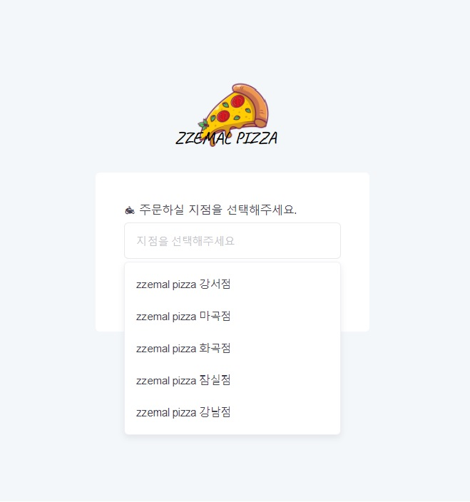
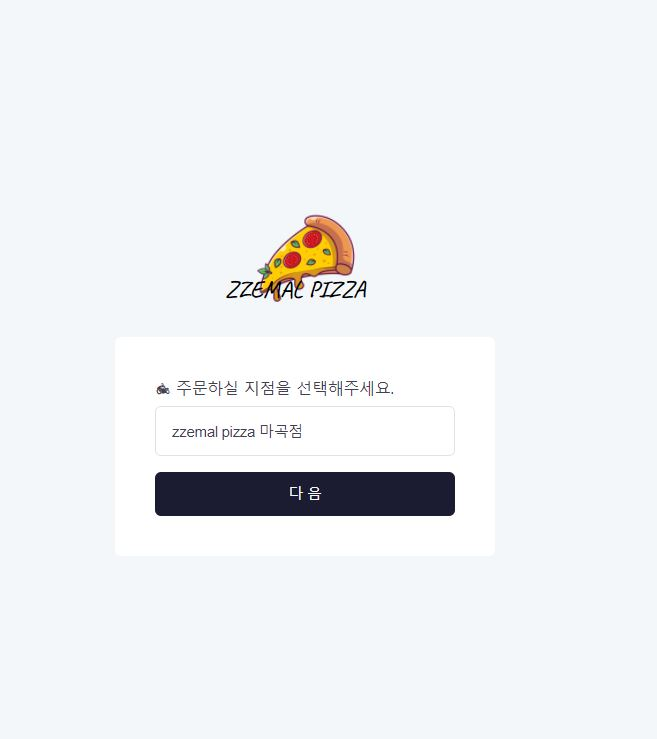

# PIZZA STORE

DOM에 대해 공부하면서 만들어 본 페이지입니다.

[김버그](https://www.youtube.com/watch?v=OSFTXX_ex7I)
를 통해 배우게 되었습니다.

## 결과

[브라우저에서 보기!](https://jh8057.github.io/zzemal/projects/05.eventPizza/)

</img>
</img>
</img>

버튼을 눌러 지점을 선택하면 다음버튼이 활성화되는 페이지입니다.  
지점을 제대로 선택하지 않을았을때 자연스럽게 처리하도록 설정해주었습니다.

## 내용

#### JS

- addeventlistener를 사용하였다.
- addeventlistener("blur") 에 대해 알아보았다.
- classList를 이용하였다.
- setAtrribute, removeAttribute 등 속성값 제어를 알게되었다.

#### CSS

- 단순 display:none이 아닌 max-height: 0를 통해 화면에 안보이게했다.
- focus에 대해 배웠다.
- flex 사용법을 조금 더 알게되었다.
- line-height를 많이 쓰는걸 확인했다.
- button의 새로운 사용법을 알게 되었다.
- border를 사용하는 법을 조금 더 알게 되었다.

#### HTML

- button 태그 속성에 disable에 대해 배웠다.

#### DOM

- 캡쳐/버블링에 대해 알게 되었다.
- 브라우저에 따라 구현이 안되는 경우가 생겨서, relatedTarget를 사용했다.
