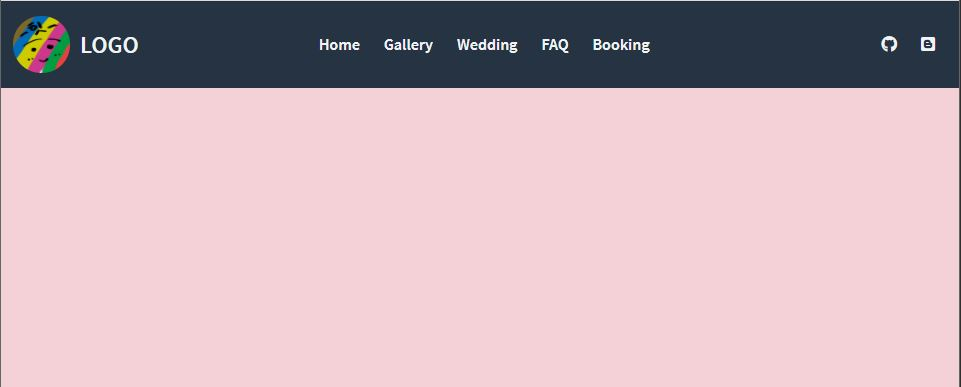
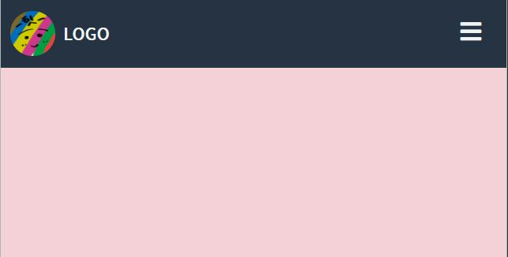
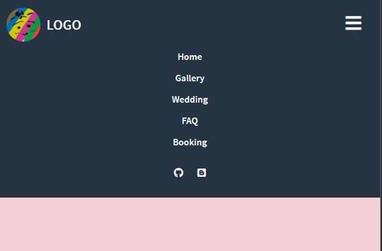

# Menu Bar

반응형 웹 페이지에 대해 공부하면서 만들어 보았습니다.

[드림 코더](https://www.youtube.com/watch?v=X91jsJyZofw&list=PLv2d7VI9OotQ1F92Jp9Ce7ovHEsuRQB3Y&index=14) 를 통해 배우게 되었습니다.

## 결과

[브라우저에서 보기!](https://jh8057.github.io/zzemal/projects/07.menuBar/)

</img> 기본 페이지

</img> Mobile 페이지

</img>
Button 클릭 시 페이지

크기가 작아지면 반응하는 메뉴바입니다. 모바일에서는 오른쪽 상단 버튼을 누르면 메뉴가 펼처집니다.

## 내용

#### CSS

- :root를 통해 css에서도 변수 선언을 할 수 있다는 것을 알게 되었다.
- flex를 사용하여 구현하였다.
- 각 메뉴들을 padding을 통해 간격조절을 하였다.
- 미디어 쿼리를 통해 화면이 작아지면 toggle버튼이 생기게 하였다.

#### JS

- toggle버튼을 누르면 clicked라는 class를 toggle하도록 하였다.(addeventlistener)
