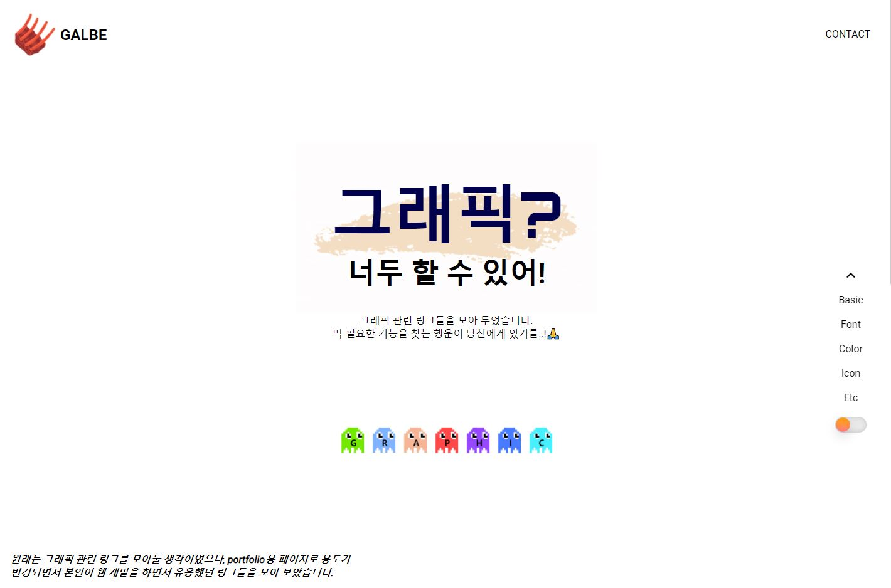
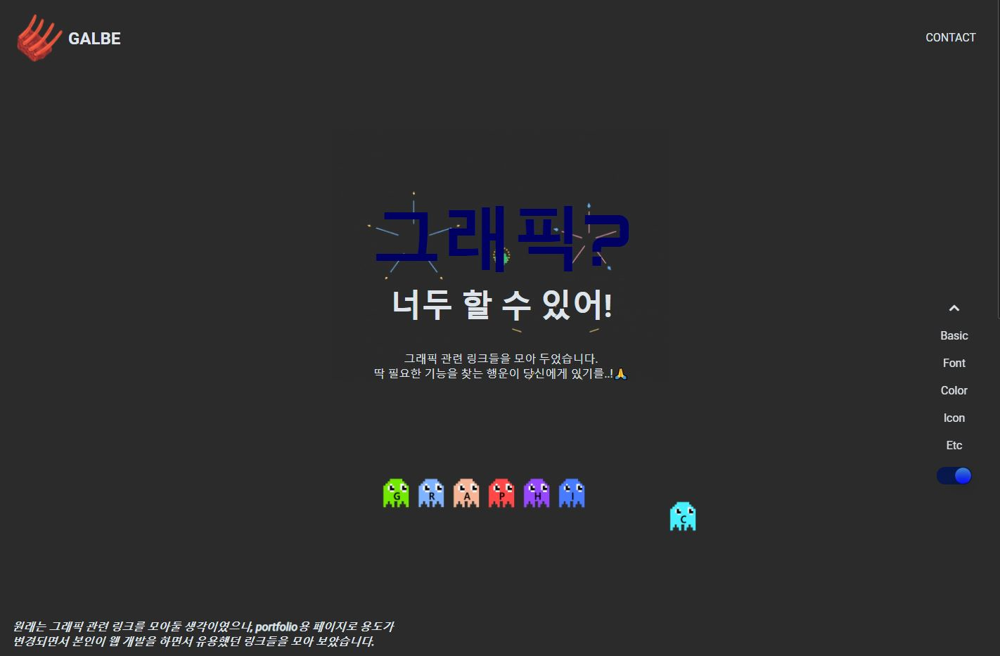
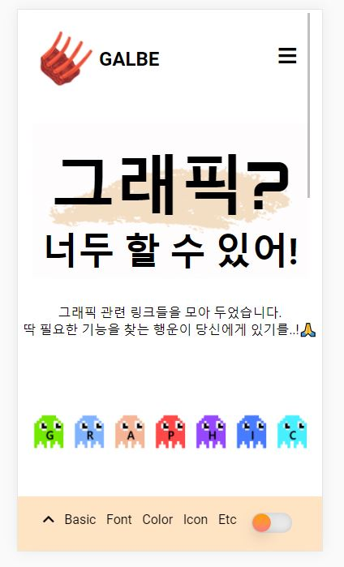
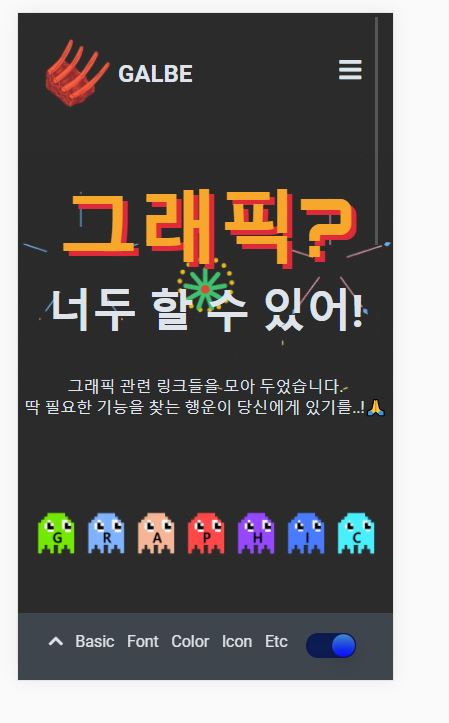

# GALBE - Graphic Links

Link가 정리가 안된다는 형의 말을 듣고 만들기 시작한 페이지 입니다.

## 결과

[브라우저에서 보기!](https://jh8057.github.io/zzemal/projects/graphicLinks/)

 메인 화면
 다크모드

 모바일 화면

<!-- </img> -->

## 내용

- data.json 파일에 정해진 규격으로 들어가 있는 link들을 각 카테고리에 맞게 보이도록 만들었습니다.
- 다크모드를 추가하였습니다.
- 가운데 마우스 이벤트에 따라 반응하는 icon을 배치하였습니다.
- 메인 타이틀을 keyframe을 통해 애니메이션 느낌이 나도록 구현했습니다. (뒷 배경은 gif)

#### JS

- fetch()를 통해 data를 읽고 화면에 나오도록 만들었습니다.
- window.innerHeight 과 random 함수를 통해 랜덤으로 움직이는 icon을 만들었습니다.

#### CSS

- `background: center/480px no-repeat url("img/firework.gif");` 형식을 알게 되었다.
- keyframe을 활용해서 애니메이션을 만들어 보았다.

#### HTML

- nav 에서 a 태그를 이용해서 원하는 카테고리로 바로 이동 할 수 있도록 만들었습니다.

#### 다크모드

- 다크모드 구현하는데 고생을 했다.
- a 태그를 모드 변경해주고, background-image에 사용된 gif도 변경해주어 느낌을 바꾸어주었다
- 모바일 사이즈일때는 nav바가 아래로 가면서 배경색이 생긴다. 즉, pc모드일때랑 mobile일떄 background-color가 차이나는데, resize를 통해 버튼이 눌른 상태에서 화면이 작아져서 mobile 모드가 되어도 원하는 색이 나오도록 JS와 CSS를 처리해 주었다.
