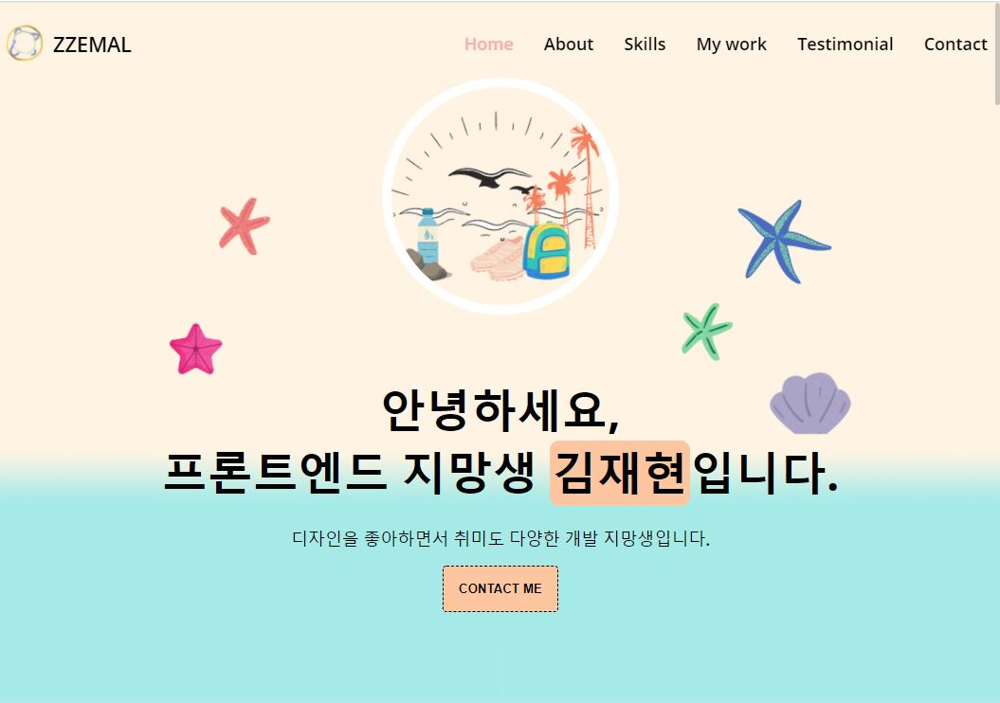
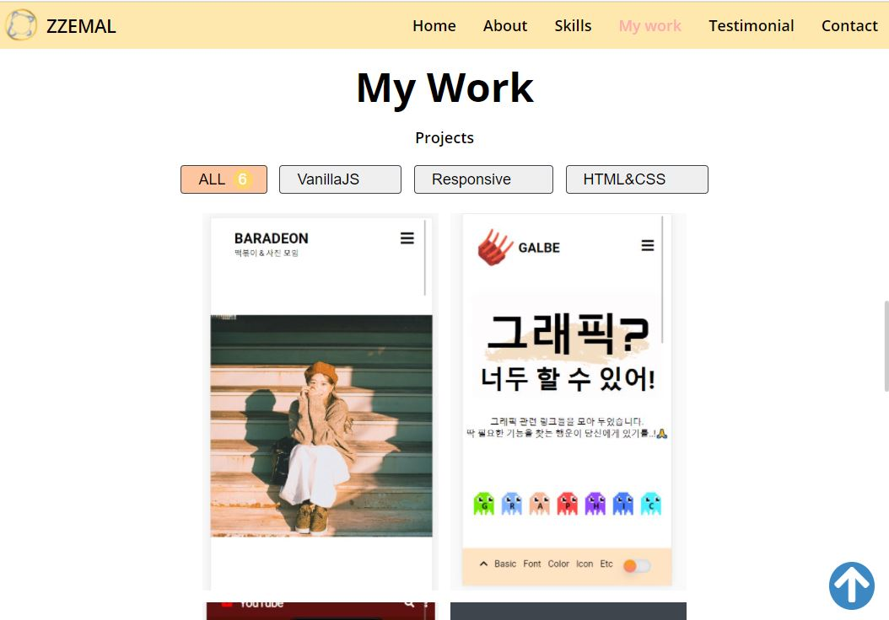
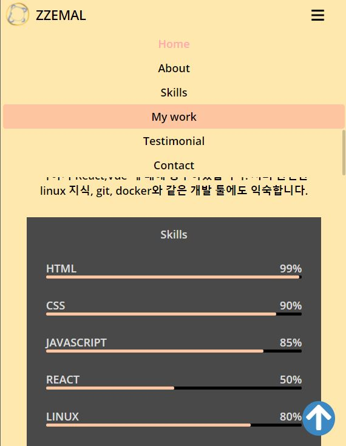

# Portfolio

저를 잘 표현할 수 있도록 구현했습니다.  
[드림 코딩 아카데미](https://academy.dream-coding.com/) 에서 배운 내용을 토대로 만들었습니다.

# 결과

[브라우저에서 보기!](https://jh8057.github.io/zzemal/projects/portfolio/)

 메인 화면
 모바일 화면

# 내용

- 반응형이 제대로 동작하도록 만들었습니다.

#### JS

- scroll에 따라, fixed 버튼이 생성되고, menubar가 변화가 생기는 등 동적인 요소를 추가해 주었습니다.
- My work에서 버튼을 누르면 해당 프로젝트들만 나오는 filter버튼을 구현했습니다.
- 클릭 후, 기존 선택된 요소는 삭제되고, 새로 선택 된 요소의 색만 유지되도록 구현했습니다.

#### CSS

- hover,after를 이용해 소소한 이벤트들을 추가했습니다.
- linear-gradient를 통해 section간의 배경 변화 어색함을 없애주었습니다.
- display, position을 적절히 사용하였습니다.

#### HTML

- nav바를 클릭하면 해당 지점으로 이동되도록 구현하였습니다.
- 구현하는데 addeventlistener와 a태그 2가지 방법이 있었는데, a태그를 사용하고 behavior를 smooth로 설정해 주었습니다.
- meta를 통해 페이지 정보, 만든이 등을 넣어주었습니다.
