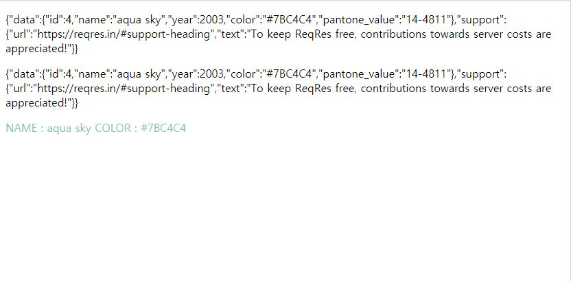
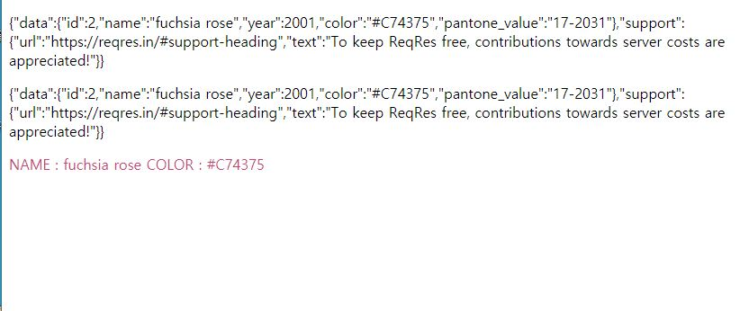

# XHR 예제

MDN글의 XHR 예제를 조금 변경해 보았습니다.

`https://reqres.in/`에서 Ajax에 활용가능한 데이터를 얻어 올 수 있다.
해당 api를 이용하여 Json 파일을 얻어 온 후 활용할 수 있도록 아래처럼 변경하여 실행해보았다.

# 결과

</img>
</img>

이 처럼 시간이 지남에 따라 화면에 글자가 변경되고, 데이터에 따라 색도 변경되는 것을 확인하였다.

# 변경사항

```
 //새로운 p 태그 생성
 <p id="userinfo">No Data yet</p>

 //script에서 이를 가져오는 변수 선언
 const userinfo = document.getElementById("userinfo");

//fetchData()에 random변수 추가 및 URL 변경
const random = Math.ceil(Math.random() * 10);
xhr.open("GET", `https://reqres.in/api/user/${random}`, true);

// xhr.onload에 추가
updateUserinfo(xhr.response);

//받은 데이터 안에서 색 정보를 가져와서 변경하는 함수
function updateUserinfo(string) {
  const obj = JSON.parse(string);
  userinfo.textContent =
    "NAME : " + obj.data.name + " COLOR : " + obj.data.color;
  userinfo.style.color = obj.data.color;
}
```
